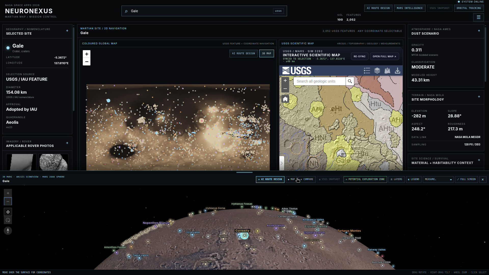
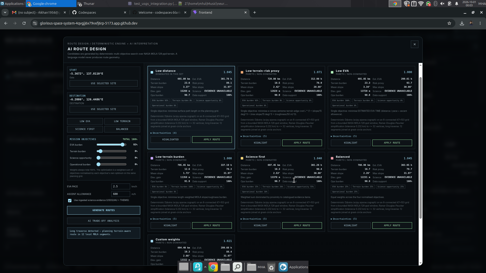
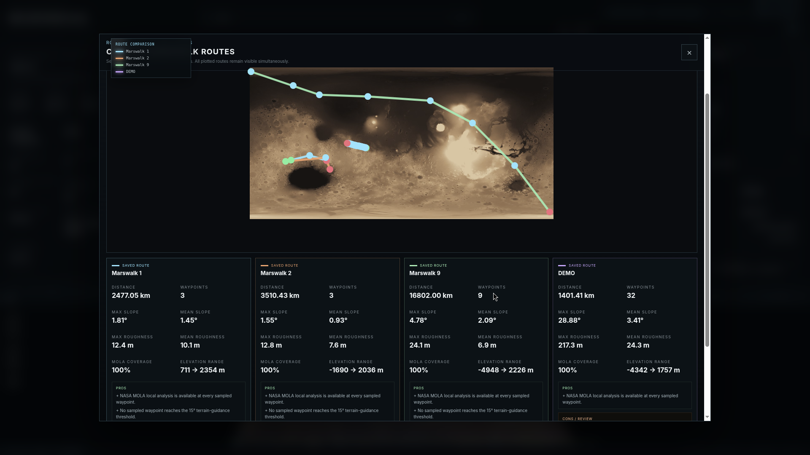
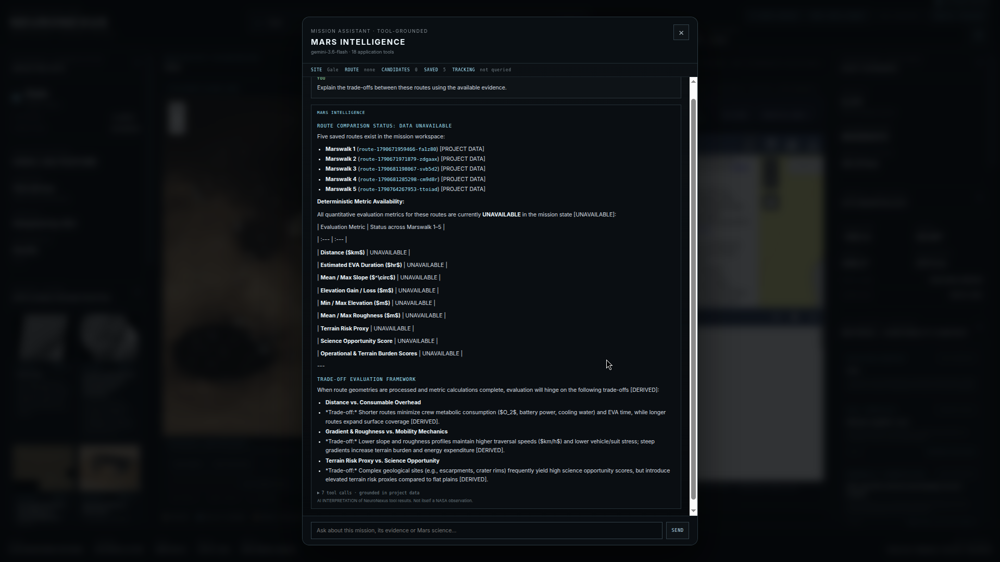
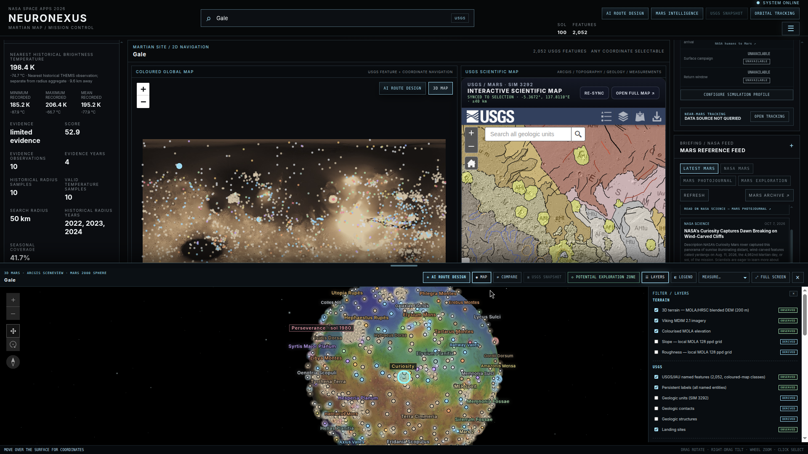
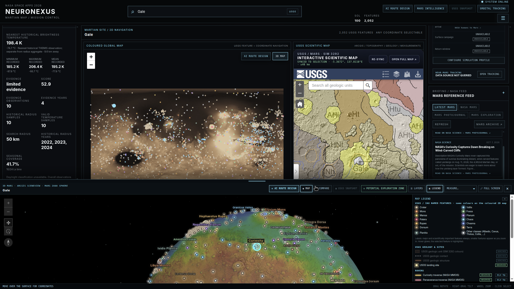
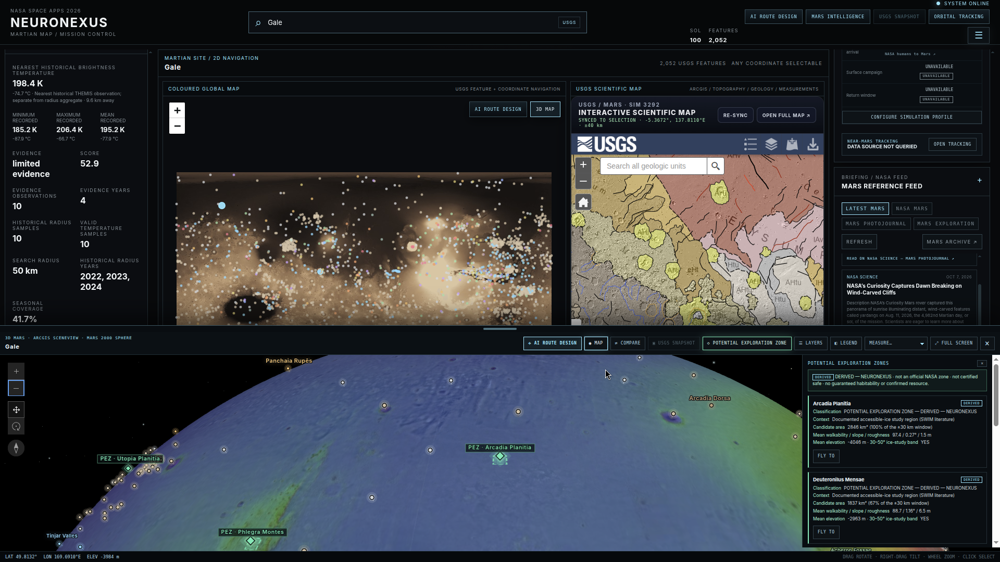
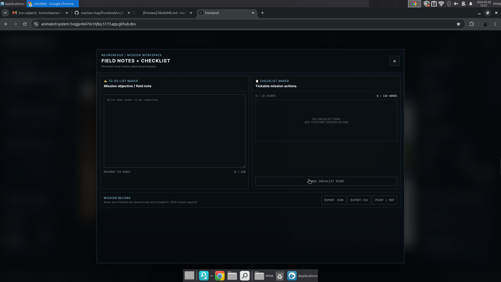

# NeuroNexus - Interplanetary Survival Guide: Martian Map

NASA Space Apps Challenge 2026 · branch Master-Ai

## Demo video

<iframe width="100%" height="600" src="https://www.youtube.com/embed/0MLtYKHewcA" title="NeuroNexus: Interplanetary Survival Guide: Martian Map" frameborder="0" allow="accelerometer; autoplay; clipboard-write; encrypted-media; gyroscope; picture-in-picture; web-share" referrerpolicy="strict-origin-when-cross-origin" allowfullscreen></iframe>

Setup first: SETUP_INSTRUCTIONS.md contains the complete installation, NASA data, Gemini API-key, backend/frontend startup, troubleshooting, and demo instructions.

Setup instructions:
https://github.com/kmmohaimenulhaque-code/martian-map/blob/Master-Ai/SETUP_INSTRUCTIONS.md

OUR CHALLENGE:

NASA has explored Mars robotically for decades, studying its extreme environment, mapping its surface, and collecting many types of data.
Far from home, the first astronauts to set foot on Mars will want the best map possible, with information on the details of their routes and destinations, updates on current conditions, and the data necessary to make safe and scientifically meaningful decisions.

Project Description 

NeuroNexus is an interactive planetary mission-planning and scientific intelligence system for Mars. It combines authoritative Mars datasets, deterministic terrain analysis, multi-objective route generation, and transparent AI interpretation to support mission planning and exploration decisions.

The goal is not to declare a universally "safe" place on Mars. NeuroNexus provides transparent evidence and derived planning aids so explorers can compare terrain, environment, science opportunities, and operational constraints before deciding on a route or site.

What it does

* 2D Mars map + USGS scientific map: synchronized exploration views with 2,052 USGS/IAU named Martian features.
* Interactive 3D Mars: ArcGIS Maps SDK SceneView using Mars 2000 coordinates, public Mars terrain/imagery services, persistent annotations, USGS feature classes, geology, landing sites, rover locations, and terrain overlays.
* AI Route Designer: deterministic multi-objective route generation over bounded NASA MOLA terrain, with candidates for EVA, terrain, science, operational, distance, and terrain-risk objectives.
* Terrain intelligence: NASA MOLA elevation with derived slope, roughness, local relief, terrain burden, and a clearly labelled NeuroNexus walkability score.
* Environmental context: Mars weather/environment assessment, NASA Ames MY34 dust modelling, historical THEMIS thermal observations, and site-science provenance.
* Science + exploration context: ancient-habitability evidence, documented accessible-ice study regions, potential exploration zones, landing sites, rover traverses, and human-exploration context.
* Mission awareness: NASA/JPL near-Mars small-body close-approach tracking.
* USGS route snapshot + exports: route visualisation against USGS SIM 3292 geology plus JSON/CSV exports.
* Mars Intelligence: Google Gemini interprets structured NeuroNexus results and explains trade-offs; Gemini does not generate route geometry or alter deterministic numerical results.

## Screenshots : the mission console in action

The screenshots below show the Master-Ai interface, including Gale site context, historical thermal evidence, route comparison, and the interactive 3D workspace. Displayed values belong to the captured application state used in this project.

### Site selection and synchronized maps



The main console brings USGS/IAU site identity and coordinates, applicable rover imagery, NASA Ames dust-model context, and NASA MOLA terrain metrics alongside the 2D, USGS geology, and 3D views.

### Historical THEMIS thermal evidence


The THEMIS panel keeps the nearest historical brightness temperature separate from the minimum, maximum, and mean shown directly beneath it in Kelvin and Celsius. Historical sample counts, the 50 km search radius, observation years, and seasonal coverage are available beside the thermal series.

### AI Route Designer : deterministic candidates



The route-design workspace lets users set start and destination coordinates, adjust mission-objective weights, and configure EVA pace and ascent allowance. Candidate cards compare distance, estimated travel time, terrain burden, roughness, and route suitability.

### Saved-route comparison



Colour-coded saved routes remain visible together while comparison cards show distance, waypoint counts, slope, roughness, MOLA coverage, elevation range, and review notes.

### Mars Intelligence : tool-grounded interpretation



Mars Intelligence uses structured mission context and application tools to explain evidence and route trade-offs. This captured response lists saved routes but marks their quantitative comparison as unavailable when the deterministic metric is not present.

### Interactive 3D layers



The 3D layer panel groups terrain, imagery, colourised elevation, USGS/IAU named features, geology, and landing-site overlays. Observed and derived labels distinguish source data from NeuroNexus computed values.

### Map legend and rover context



The legend explains named-feature colours, geologic symbols, landing sites, and rover-traverse layers. It keeps the map symbology and provenance labels visible beside the interactive scene.

### Potential exploration zones



The exploration-zone view connects derived candidate areas to documented study-region context and terrain summaries, with controls to fly to a region. These zones are NeuroNexus planning aids—no single zone is declared "safe" or habitable.

### Field notes and mission checklist



The mission workspace keeps field notes and tickable checklist actions alongside the planning workflow. It supports local-save persistence and export to JSON, CSV, and printable or PDF formats.

Scientific data and external sources

NASA

* NASA Planetary Data System (PDS): primary archival source framework.
* Mars Global Surveyor / MOLA: MEGDR 128 pixels/degree global topography and 512 pixels/degree polar topography for elevation and terrain analysis.
* Mars Odyssey / THEMIS: historical visible and thermal observations, including IR predicted brightness-temperature context.
* NASA Ames Research Center Mars Global Climate Model: MY34 dust scenario used for modelled dust context.
* Mars Science Laboratory / Curiosity: rover science context and historical RAD surface-radiation reference.
* Mars 2020 / Perseverance: mission science context and rover traversal data.
* NASA MMGIS: real Curiosity and Perseverance traverse layers used by the 3D rover-path visualisation.
* NASA Image and Video Library: mission and rover imagery metadata.
* NASA human-exploration references: EVA, Mars mission, radiation, Martian dust, life-support and mobility context.
* NASA SWIM / NASA Mars Water Maps: accessible-ice exploration context. The full SWIM ice-consensus raster is explicitly marked UNAVAILABLE in NeuroNexus; documented study regions are not presented as a substitute.

USGS / IAU

* USGS Gazetteer of Planetary Nomenclature / IAU: 2,052 named Martian features, coordinates, feature types, and identity.
* USGS SIM 3292 — Geologic Map of Mars (Tanaka et al., 2014): geologic units, contacts, structures, landing-site layer, and scientific route snapshots.

NASA/JPL

* NASA/JPL Solar System Dynamics Close-Approach Data API: near-Mars small-body close-approach awareness, distance and uncertainty information.

Other external services and partners

* Esri / ArcGIS Mars services: public Mars terrain/elevation services, Viking MDIM imagery, colourised elevation, and ArcGIS delivery of USGS geology used by the 3D experience.
* ESA: Mars Express and ExoMars public feeds used by the Mars briefing subsystem.
* The Planetary Society: public Mars article feed used by the Mars briefing subsystem.
* Google Gemini API: AI interpretation of structured NeuroNexus results; the API key remains server-side and Gemini output is never treated as a NASA observation.

The machine-readable provenance ledger is available at data/manifests/source_ledger.json.

Evidence and provenance

NeuroNexus distinguishes:

* OBSERVED / NASA OBSERVED - measurements or archived observations from a named source.
* NASA REFERENCE - published NASA/USGS reference information or catalogue data.
* MODELED - output of a physical model such as the NASA Ames Mars GCM.
* DERIVED / COMPUTED - values calculated by NeuroNexus from source data.
* SIMULATED - configurable project simulation values.
* UNAVAILABLE - no ingested evidence; NeuroNexus does not invent a substitute.

Examples of NeuroNexus-derived outputs include the multi-objective route engine, route metrics, walkability score, terrain-risk proxy, EVA-time estimate, and potential exploration-zone scoring.

NeuroNexus does not label any route or location as NASA-certified safe, universally best, habitable, or resource-confirmed.

Architecture

Authoritative Mars data
        ↓
Ingestion + validation
        ↓
Scientific indexes / bounded terrain windows
        ↓
Deterministic terrain + route analysis
        ↓
FastAPI mission services
        ↓
React/Vite mission console
        ↙       ↓        ↘
     2D map   3D Mars   USGS map
        ↘       ↓        ↙
          shared mission state
Google Gemini
      ↓
AI interpretation of structured results

Stack

Frontend

* React 19
* Vite
* Leaflet / React-Leaflet
* ArcGIS Maps SDK for JavaScript, loaded on demand for 3D

Backend

* Python
* FastAPI + Uvicorn
* NumPy / SciPy / Pandas / Polars / PyArrow
* Rasterio / GeoPandas / Shapely / PyProj
* PDS4 Tools
* VTK / PyVista / Trimesh
* Google GenAI SDK

Acceleration / development

* AMD Instinct MI300X + ROCm for terrain and engineering acceleration work
* Large/generated datasets and assets are handled through manifests, Git LFS, submodules, or external services where appropriate.

Gemini AI setup

AI is optional for the rest of NeuroNexus.

Create .env in the repository root:

GEMINI_API_KEY=your_gemini_api_key_here
GEMINI_MODEL=gemini-3.6-flash

A safe template is provided as .env.example.

Never commit a real Gemini API key. The backend reads GEMINI_API_KEY; it is never sent to the browser.

For the complete setup and model troubleshooting flow, see SETUP_INSTRUCTIONS.md.

Quick start

Use the full SETUP_INSTRUCTIONS.md for installation, data acquisition, Gemini configuration and startup.

The intended branch is:

Master-Ai

Backend:
```
python -m uvicorn science.weather.api.environment:app --host 127.0.0.1 --port 8002
```
Frontend:
```
cd frontend
npm install
npm run dev
```
Validation

The repository contains tests covering AI behaviour, routing, USGS integration, orbital tracking, Mars 3D services, exports, and other mission subsystems.

Run:
```
python -m pytest tests -q
cd frontend && node --test "tests/*.test.js"
npm run build
```
Runtime notes

* The ArcGIS 3D experience loads only when opened and requires internet access to Esri's public services.
* The NASA MOLA raw terrain dataset is large; follow the Git LFS/PDS instructions in SETUP_INSTRUCTIONS.md.
* The SWIM water-ice consensus raster is currently UNAVAILABLE in the application; related regions are presented only as documented exploration-study context.
* Some high-resolution orbital datasets listed in the scientific catalogue remain explicitly not-ingested rather than being fabricated.
* The 3D terrain service and local MOLA measurements may differ because they come from different terrain products/resolutions; NeuroNexus keeps that distinction explicit.

Repository

NASA Space Apps 2026 submission branch:
https://github.com/kmmohaimenulhaque-code/martian-map/tree/Master-Ai

Source ledger:
https://github.com/kmmohaimenulhaque-code/martian-map/blob/Master-Ai/data/manifests/updated_source_ledger.json
